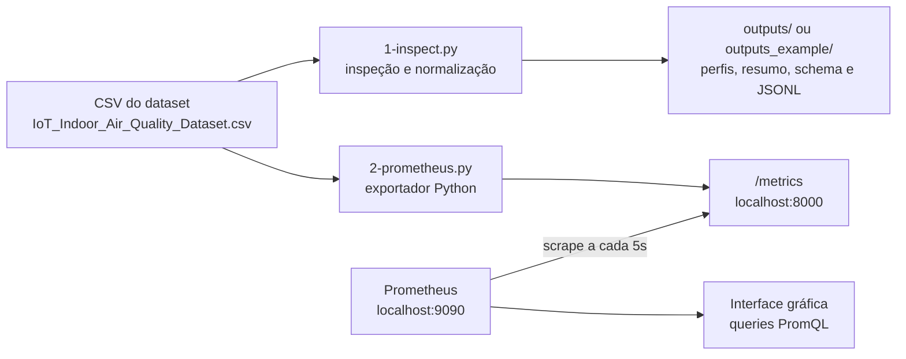

# Aula 1 - Datasets

Esta aula usa um dataset de qualidade do ar em ambientes internos para praticar inspeção de dados, normalização de eventos IoT e exposição de métricas Prometheus.

## Estrutura

- `data/`: contém o CSV usado na aula e a referência da fonte do dataset.
- `scripts/`: contém os scripts Python e o `requirements.txt`.
- `outputs/`: recebe os arquivos gerados localmente pelo script de inspeção.
- `outputs_example/`: contém uma execução de exemplo versionada para consulta.

Scripts principais:

- `scripts/1-inspect.py`: lê o CSV, normaliza nomes de colunas, gera perfis, resumo numérico, eventos JSONL e schema.
- `scripts/2-prometheus.py`: lê o CSV e expõe leituras simuladas como métricas Prometheus em `/metrics`.

## Análise por inspeção

A análise por inspeção é a primeira etapa da prática. O objetivo é entender o dataset antes de integrá-lo a uma ferramenta de observabilidade.

O script `scripts/1-inspect.py` faz uma leitura exploratória do arquivo `data/IoT_Indoor_Air_Quality_Dataset.csv` sem modificar o CSV original. Durante a execução, ele:

- normaliza os nomes das colunas para nomes mais fáceis de usar em código;
- identifica colunas numéricas que representam medições de sensores;
- classifica colunas em categorias semânticas, como `measurement`, `metadata`, `event`, `state` e `command`;
- calcula estatísticas descritivas das colunas numéricas;
- gera um schema mínimo para eventos IoT;
- transforma parte das leituras em eventos normalizados no formato JSONL.

Os arquivos gerados em `outputs/` servem como evidência da inspeção. A pasta `outputs_example/` guarda uma amostra desses resultados para consulta sem precisar executar o script.

- `columns_profile.csv`: perfil técnico das colunas, incluindo tipo, valores nulos, valores únicos e exemplos.
- `semantic_classification.csv`: classificação semântica das colunas.
- `numeric_summary.csv`: resumo estatístico das medições numéricas.
- `normalized_events.jsonl`: eventos IoT normalizados a partir das leituras do CSV.
- `iot_event_schema.json`: schema mínimo usado para representar eventos IoT.
- `inspection_summary.json`: resumo da execução do script.

Essa etapa ajuda a responder perguntas como: quais colunas são medições? quais são metadados? quais unidades aparecem? quais dados podem virar métricas?

## Integração dos dados no Prometheus

Depois da inspeção, o script `scripts/2-prometheus.py` usa o CSV como fonte de uma simulação de sensores. Ele lê uma linha por vez, extrai as colunas numéricas e publica os valores como métricas no formato esperado pelo Prometheus.

O script funciona como um exportador Prometheus:

- lê o CSV;
- normaliza os nomes das colunas;
- identifica medições numéricas;
- cria métricas `Gauge`;
- publica as métricas em `http://localhost:8000/metrics`;
- atualiza os valores a cada 5 segundos;
- calcula uma flag simples de anomalia com base em média e desvio padrão.

O Prometheus não lê o CSV diretamente. Ele coleta as métricas expostas pelo script Python. Por isso há dois serviços diferentes:

- Prometheus: interface e banco de séries temporais em `http://localhost:9090`;
- Exportador Python: endpoint de métricas em `http://localhost:8000/metrics`.

Fluxo da integração:



Principais métricas publicadas:

- `opaiot_iaq_sensor_value`: valor atual simulado de cada medição do dataset.
- `opaiot_iaq_anomaly_flag`: indica anomalia simples quando o valor se afasta muito da média.
- `opaiot_iaq_stream_index`: linha atual do CSV sendo simulada.
- `opaiot_iaq_dataset_rows`: quantidade total de linhas carregadas.
- `opaiot_iaq_active_metrics`: quantidade de colunas numéricas exportadas.

## 1. Acessar a VM Linux pelo Windows

No Windows, abra o PowerShell e confirme que o cliente SSH está disponível:

```powershell
ssh -V
```

Defina o usuário e o IP da VM. Ajuste os valores conforme sua VM:

```powershell
$VM_USER = "ubuntu"
$VM_HOST = "192.168.0.10"
```

Acesse a VM:

```powershell
ssh "${VM_USER}@${VM_HOST}"
```

Se a VM usa chave SSH, informe o arquivo da chave:

```powershell
ssh -i "$env:USERPROFILE\.ssh\id_ed25519" "${VM_USER}@${VM_HOST}"
```

## 2. Clonar o repositório na VM

Dentro da VM Linux, instale os pacotes básicos:

```bash
sudo apt update
sudo apt install -y git python3 python3-pip python3-venv curl
```

Clone o repositório:

```bash
cd ~
git clone https://github.com/Smart-LaSDPC/opaIOT_2026.git
cd opaIOT_2026/Modulo_3/Aula_1_datasets
```

## 3. Preparar o ambiente Python

Entre na pasta de scripts:

```bash
cd ~/opaIOT_2026/Modulo_3/Aula_1_datasets/scripts
```

Crie e ative um ambiente virtual:

```bash
python3 -m venv .venv
source .venv/bin/activate
```

Instale as dependências:

```bash
python -m pip install --upgrade pip
python -m pip install -r requirements.txt
```

## 4. Executar o script de inspeção

Execute:

```bash
python 1-inspect.py
```

Os arquivos serão gerados em:

```text
~/opaIOT_2026/Modulo_3/Aula_1_datasets/outputs/
```

Se você ainda não executou o script, consulte `outputs_example/` para ver uma amostra dos arquivos esperados.

Confira o resultado:

```bash
ls -lah ../outputs
```

Arquivos esperados:

- `columns_profile.csv`
- `semantic_classification.csv`
- `numeric_summary.csv`
- `normalized_events.jsonl`
- `iot_event_schema.json`
- `inspection_summary.json`

## 5. Executar o exportador Prometheus

Execute:

```bash
python 2-prometheus.py
```

O script fica em execução contínua e expõe métricas em:

```text
http://localhost:8000/metrics
```

O intervalo atual de publicação do script é de 5 segundos:

```python
INTERVAL_SECONDS = 5.0
```

Para testar dentro da VM:

```bash
curl http://localhost:8000/metrics | head
```

Para encerrar, pressione `Ctrl+C`.

### Prometheus instalado diretamente na VM

Se o Prometheus estiver instalado diretamente no Ubuntu, sem Docker, configure o target como `localhost:8000`.

Edite o arquivo:

```bash
sudo nano /etc/prometheus/prometheus.yml
```

Inclua ou ajuste o job da aula:

```yaml
scrape_configs:
  - job_name: "opaiot_iaq"
    scrape_interval: 5s
    static_configs:
      - targets: ["localhost:8000"]
```

Valide a configuração:

```bash
promtool check config /etc/prometheus/prometheus.yml
```

Nesta VM, o Prometheus é reiniciado manualmente. Encerre o processo atual e suba novamente com:

```bash
pkill -f prometheus
prometheus --config.file=/etc/prometheus/prometheus.yml --storage.tsdb.path=/var/lib/prometheus --web.listen-address=0.0.0.0:9090
```

Deixe esse terminal aberto. Em outro terminal, com o `2-prometheus.py` rodando, teste:

```bash
curl http://localhost:8000/metrics | head
curl http://localhost:9090/-/healthy
```

Na interface do Prometheus, abra:

```text
http://localhost:9090/targets
```

O job `opaiot_iaq` deve aparecer como `UP`.

Para iniciar o processo em segundo plano faça:
```bash
nohup prometheus --config.file=/etc/prometheus/prometheus.yml --storage.tsdb.path=/var/lib/prometheus --web.listen-address=0.0.0.0:9090 > prometheus.log 2>&1 &
```

### Prometheus rodando em container Docker

Se o Prometheus estiver rodando em um container Docker, cuidado com `localhost`: dentro do container, `localhost` aponta para o próprio container, não para a VM Ubuntu.

Nesse caso, o script Python continua rodando na VM em:

```text
http://localhost:8000/metrics
```

Mas o `prometheus.yml` do container deve apontar para o host Docker. No Linux, uma forma prática é usar `host.docker.internal` com o mapeamento `host-gateway`.

Exemplo de `prometheus.yml`:

```yaml
scrape_configs:
  - job_name: "opaiot_iaq"
    scrape_interval: 5s
    static_configs:
      - targets: ["host.docker.internal:8000"]
```

Se o container foi iniciado com `docker run`, inclua:

```bash
--add-host=host.docker.internal:host-gateway
```

Exemplo:

```bash
docker run -d \
  --name prometheus \
  -p 9090:9090 \
  --add-host=host.docker.internal:host-gateway \
  -v "$PWD/prometheus.yml:/etc/prometheus/prometheus.yml" \
  prom/prometheus
```

Se estiver usando `docker compose`, inclua no serviço do Prometheus:

```yaml
extra_hosts:
  - "host.docker.internal:host-gateway"
```

Depois reinicie o container:

```bash
docker compose restart prometheus
```

Para testar se o container alcança o exportador Python:

```bash
docker exec prometheus wget -qO- http://host.docker.internal:8000/metrics | head
```

Se o nome do container não for `prometheus`, descubra com:

```bash
docker ps
```

Alternativa: usar o IP da bridge Docker da VM no `prometheus.yml`:

```bash
ip -4 addr show docker0
```

Normalmente será algo como `172.17.0.1`; nesse caso, o target ficaria:

```yaml
targets: ["172.17.0.1:8000"]
```

Se quiser acessar as métricas pelo navegador do Windows, uma opção segura é abrir um túnel SSH em outro PowerShell:

```powershell
ssh -L 8000:localhost:8000 "${VM_USER}@${VM_HOST}"
```

Depois abra no Windows:

```text
http://localhost:8000/metrics
```

## 6. Copiar os outputs da VM para o Windows com scp

Depois de executar `1-inspect.py` na VM, saia da sessão SSH ou abra outro PowerShell no Windows.

Defina novamente as variáveis, se necessário:

```powershell
$VM_USER = "ubuntu"
$VM_HOST = "192.168.0.10"
```

Crie uma pasta local para receber os arquivos:

```powershell
mkdir "$env:USERPROFILE\Downloads\opaIOT_Aula_1_datasets_outputs"
```

Copie a pasta `outputs` da VM para o Windows:

```powershell
scp -r "${VM_USER}@${VM_HOST}:~/opaIOT_2026/Modulo_3/Aula_1_datasets/outputs" "$env:USERPROFILE\Downloads\opaIOT_Aula_1_datasets_outputs"
```

Se a VM usa chave SSH:

```powershell
scp -i "$env:USERPROFILE\.ssh\id_ed25519" -r "${VM_USER}@${VM_HOST}:~/opaIOT_2026/Modulo_3/Aula_1_datasets/outputs" "$env:USERPROFILE\Downloads\opaIOT_Aula_1_datasets_outputs"
```

Confira no Windows:

```powershell
Get-ChildItem "$env:USERPROFILE\Downloads\opaIOT_Aula_1_datasets_outputs" -Recurse
```

## 7. Problemas comuns

Se aparecer `ModuleNotFoundError`, ative o ambiente virtual e reinstale as dependências:

```bash
source .venv/bin/activate
python -m pip install -r requirements.txt
```

Se a porta `8000` estiver ocupada, edite a constante `PORT` no topo de `scripts/2-prometheus.py`.

Se o `scp` retornar `No such file or directory`, confira na VM se a pasta existe:

```bash
ls -lah ~/opaIOT_2026/Modulo_3/Aula_1_datasets/outputs
```

Execute os scripts como arquivos:

```bash
python 1-inspect.py
python 2-prometheus.py
```

Não use `python -m` com esses nomes, pois `1-inspect.py` e `2-prometheus.py` são nomes de arquivo, não nomes de módulo Python.
