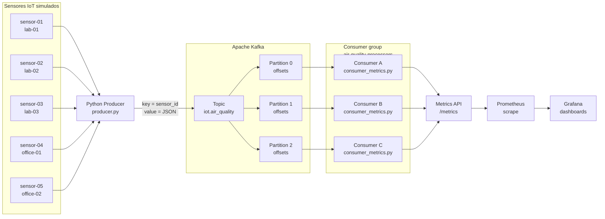

# Aula 3 - Apache Kafka para telemetria IoT observável

Esta aula prática apresenta o Apache Kafka como infraestrutura para pipelines orientados a eventos em IoT. O cenário simula sensores ambientais enviando medições para um tópico Kafka, consumidores processando esses eventos e métricas sendo expostas para Prometheus e Grafana.

Para execução com Docker veja [Aula_3_kafka](./docker/README.md).

## 1. Visão conceitual

Kafka não deve ser entendido apenas como uma fila de mensagens. Nesta prática, ele aparece como um **log distribuído de eventos**, em que producers publicam eventos em tópicos, tópicos são divididos em partitions e consumers leem esses eventos mantendo offsets.

Os conceitos principais são:

- **Producer**: aplicação que publica eventos no Kafka. Na prática, é um script Python que simula sensores.
- **Event**: uma medição IoT enviada como mensagem, contendo sensor, sala, temperatura, umidade, CO2 e timestamp.
- **Topic**: canal lógico onde os eventos são publicados. A prática usa `iot.air_quality`.
- **Key**: valor usado para distribuir eventos entre partitions. A prática usa `sensor_id`.
- **Partition**: segmento ordenado do log. A ordem é garantida dentro de uma partition.
- **Offset**: posição de uma mensagem dentro de uma partition.
- **Consumer**: aplicação que lê eventos do Kafka.
- **Consumer group**: conjunto de consumers que divide as partitions entre si.
- **Lag**: diferença entre o fim do log e o ponto já consumido por um grupo.
- **Observabilidade**: métricas expostas pelo consumer em `/metrics`, coletadas pelo Prometheus e visualizadas no Grafana.

Topologia conceitual da prática:



O ponto didático central é observar que eventos do mesmo sensor tendem a permanecer na mesma partition quando `sensor_id` é usado como chave. Isso preserva a ordem das leituras daquele sensor dentro da partition e permite discutir paralelismo, offset, lag e retomada de consumo.

## 2. Resumo da prática

### Estrutura da aula

Arquivos principais:

```text
Aula_3_kafka/
├── README.md
├── instalando_kafka_vm.md
└── scripts/
    ├── README.md
    ├── producer.py
    ├── consumer_metrics.py
    ├── configure_prometheus.sh
    ├── configure_grafana.sh
    └── requirements.txt
```

Use estes materiais nesta ordem:

1. [`instalando_kafka_vm.md`](instalando_kafka_vm.md): instalação do Kafka na VM.
2. `scripts/README.md`: passo a passo detalhado de execução.
3. `scripts/producer.py` e `scripts/consumer_metrics.py`: execução da prática.
4. `scripts/configure_prometheus.sh`: configuração automática do Prometheus.
5. `scripts/configure_grafana.sh`: configuração automática do Grafana.

### Roteiro resumido

Entre no diretório da aula:

```bash
cd Modulo_3/Aula_3_kafka
```

Crie e ative o ambiente Python:

```bash
python3 -m venv .venv
source .venv/bin/activate
pip install -r scripts/requirements.txt
```

Com o Kafka rodando em `localhost:9092`, crie o tópico:

```bash
kafka-topics.sh \
  --create \
  --if-not-exists \
  --topic iot.air_quality \
  --bootstrap-server localhost:9092 \
  --partitions 3 \
  --replication-factor 1
```

Verifique:

```bash
kafka-topics.sh \
  --describe \
  --topic iot.air_quality \
  --bootstrap-server localhost:9092
```

Em um terminal, rode o producer:

```bash
python scripts/producer.py
```

Em outro terminal, rode o consumer com métricas:

```bash
python scripts/consumer_metrics.py
```

Verifique o endpoint de métricas:

```bash
curl http://localhost:8000/metrics
```

### Experimentos sugeridos

Observe producer e consumer juntos:

- eventos produzidos em JSON;
- `key=sensor_id`;
- partition atribuída;
- offset de cada mensagem;
- métricas atualizadas em `/metrics`.

Teste consumers no mesmo grupo:

```bash
METRICS_PORT=8001 CONSUMER_ID=consumer-1 python scripts/consumer_metrics.py
METRICS_PORT=8002 CONSUMER_ID=consumer-2 python scripts/consumer_metrics.py
METRICS_PORT=8003 CONSUMER_ID=consumer-3 python scripts/consumer_metrics.py
```

Todos usam o grupo padrão `air-quality-processors`. Com 3 partitions, a tendência é cada consumer receber uma partition.

Teste grupos diferentes:

```bash
GROUP_ID=air-quality-processors METRICS_PORT=8011 CONSUMER_ID=processors-1 python scripts/consumer_metrics.py
GROUP_ID=air-quality-dashboard METRICS_PORT=8012 CONSUMER_ID=dashboard-1 python scripts/consumer_metrics.py
```

Consumers em grupos diferentes leem o mesmo tópico de forma independente e mantêm offsets próprios.

Pare e reinicie o consumer:

1. Deixe o producer rodando.
2. Pare o consumer com `Ctrl+C`.
3. Aguarde alguns segundos.
4. Inicie o consumer novamente com o mesmo `GROUP_ID`.

O consumer deve retomar a leitura a partir do offset salvo.

### Prometheus e Grafana

Para configurar o Prometheus seguindo o mesmo procedimento da Aula 1, execute:

```bash
bash scripts/configure_prometheus.sh
```

Execute esse comando na VM Ubuntu onde o Prometheus está instalado, a partir do diretório `Modulo_3/Aula_3_kafka`.

O script faz backup do `prometheus.yml`, adiciona o job da prática, valida com `promtool check config` e reinicia o Prometheus usando `pkill`, como na Aula 1. O job configurado é:

```yaml
scrape_configs:
  - job_name: "iot-kafka-consumers"
    scrape_interval: 5s
    static_configs:
      - targets:
          - "localhost:8000"
```

Para múltiplos consumers:

```bash
bash scripts/configure_prometheus.sh --targets localhost:8001,localhost:8002,localhost:8003
```

Por padrão, o Prometheus fica em primeiro plano. Para iniciar em segundo plano:

```bash
bash scripts/configure_prometheus.sh --background
```

Para configurar o Grafana já instalado na VM:

```bash
bash scripts/configure_grafana.sh
```

Por padrão, o script usa `http://localhost:3000` para o Grafana, `admin/admin` como credencial inicial e `http://localhost:9090` como URL do Prometheus. Se a senha já foi alterada:

```bash
GRAFANA_USER=admin GRAFANA_PASSWORD='sua-senha' bash scripts/configure_grafana.sh
```

O script cria ou atualiza:

- data source `Prometheus - Kafka IoT`;
- pasta `OpAIoT`;
- dashboard `Kafka IoT - Telemetria Observavel`.

Dashboard:

```text
http://localhost:3000/d/iot-kafka-telemetry
```

Consultas PromQL úteis:

```promql
iot_events_consumed_total
iot_temperature_celsius
iot_humidity_percent
iot_co2_ppm
rate(iot_events_consumed_total[1m])
iot_events_by_partition_total
iot_kafka_last_offset
```

Painéis criados no Grafana:

- temperatura por sensor;
- umidade por sensor;
- CO2 por sensor;
- taxa de eventos consumidos;
- eventos por partition;
- último offset consumido por partition;
- total de eventos consumidos.

Para o passo a passo completo, consulte [scripts/README.md](scripts/README.md).

> **Caso precise reiniciar o Grafana**
> ```bash
> nohup grafana-server --homepath=/usr/share/grafana --config=/etc/grafana/grafana.ini > grafana.log 2>&1 &
>```