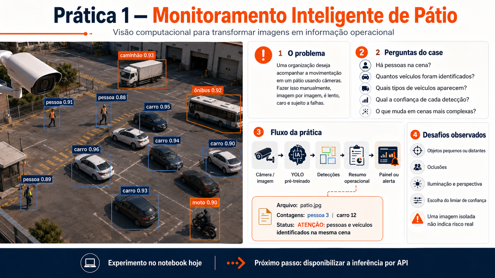

# Prática 1 - Monitoramento Inteligente de Pátio

Material prático do curso **IA, Otimização e IoT para Indústrias e Negócios - Do Zero ao MLOps**.

<p align="center">
  
</p>

## Problema

Uma organização deseja acompanhar a movimentação de pessoas e veículos em um pátio.
Nesta prática, imagens simulam capturas de uma câmera IoT e um modelo YOLO
pré-treinado transforma essas imagens em detecções, contagens e um resumo operacional.

Fazer essa análise manualmente, imagem por imagem, é lento, caro e sujeito a falhas.
O sistema deve ajudar a responder:

- há pessoas na cena?
- quantos veículos foram identificados?
- quais tipos de veículos aparecem?
- qual é a confiança de cada detecção?
- pessoas e veículos aparecem simultaneamente?
- como disponibilizar essa análise para outras aplicações?

O objetivo não é treinar um novo modelo, mas compreender a transição de um
**experimento em notebook** para um **modelo disponibilizado como serviço**.

```text
Experimento
imagem -> YOLO -> detecções -> contagens -> status operacional

Modelo como serviço
câmera/cliente -> HTTP -> FastAPI -> YOLO -> resposta JSON -> uso da informação
```

## Objetivos de aprendizagem

Ao final, o estudante deverá ser capaz de:

- executar inferência com um modelo de visão computacional pré-treinado;
- interpretar classes, confiança e caixas delimitadoras;
- transformar detecções em informação operacional;
- explicar a diferença entre notebook, cliente e servidor;
- enviar uma imagem para um modelo por meio de uma API;
- compreender o que muda quando um experimento é preparado para produção.

Docker aparece apenas como uma **extensão opcional**. Ele não é necessário para
compreender o experimento nem a arquitetura cliente-servidor.

## Solução proposta

O projeto possui três componentes principais:

1. **Experimento:** o YOLO é executado diretamente no notebook para explorar as
   imagens, as detecções e o limiar de confiança.
2. **Servidor:** a FastAPI mantém o modelo carregado e disponibiliza a inferência
   por meio de uma API HTTP.
3. **Cliente:** outro notebook simula uma câmera IoT, envia imagens ao servidor e
   utiliza a resposta em JSON.

O Docker apenas empacota o servidor e suas dependências e permanece como extensão
opcional.

## Estrutura do projeto

| Caminho | Papel na prática |
| --- | --- |
| `01_monitoramento_inteligente_de_patio.ipynb` | experimento principal com YOLO |
| `servico_patio.py` | servidor FastAPI que executa a inferência |
| `02_cliente_iot_monitoramento.ipynb` | cliente que simula uma câmera IoT |
| `images/patio/` | imagens utilizadas no case |
| `yolov8n.pt` | pesos do modelo utilizado localmente |
| `test_servico_patio.py` | testes automatizados da API |
| `requirements.txt` | ambiente completo da prática |
| `requirements-pratica1.txt` | dependências mínimas do serviço |
| `Dockerfile` | definição opcional do container |
| `assets/` | recursos visuais da documentação |

## Obter o código

```bash
git clone https://github.com/opaiot/ia-otimizacao-iot-industrias-negocios-public.git
cd ia-otimizacao-iot-industrias-negocios-public/M4/mlops/pratica-01-monitoramento-inteligente-de-patio
```

## Execução passo a passo

### Pré-requisitos

- Python 3.10, 3.11 ou 3.12;
- acesso à internet para instalar as dependências;
- JupyterLab para executar os notebooks;
- Docker Desktop somente para a extensão com container.

### 1. Preparar o ambiente

#### macOS ou Linux

```bash
cd ia-otimizacao-iot-industrias-negocios-public/M4/mlops/pratica-01-monitoramento-inteligente-de-patio
python3 -m venv .venv
source .venv/bin/activate
python -m pip install --upgrade pip
python -m pip install -r requirements.txt
```

#### Windows PowerShell

```powershell
cd ia-otimizacao-iot-industrias-negocios-public\M4\mlops\pratica-01-monitoramento-inteligente-de-patio
py -m venv .venv
.venv\Scripts\Activate.ps1
python -m pip install --upgrade pip
python -m pip install -r requirements.txt
```

Execute notebooks e comandos a partir da pasta desta prática. Isso garante que os
caminhos relativos para `assets/`, `images/` e `yolov8n.pt` sejam encontrados.

### 2. Executar o experimento no notebook

Com o ambiente ativado:

```bash
jupyter lab
```

Abra `01_monitoramento_inteligente_de_patio.ipynb` e execute as células em ordem.

O notebook:

1. apresenta o problema e as imagens do pátio;
2. carrega o modelo `yolov8n.pt`;
3. identifica pessoas e veículos;
4. apresenta classes, confiança e caixas;
5. gera contagens e um status operacional;
6. compara limiares de confiança;
7. discute limitações e prepara a transição para a API.

### 3. Iniciar o servidor FastAPI

Abra um terminal na pasta da prática, ative o ambiente e execute:

```bash
uvicorn servico_patio:app --reload
```

Mantenha esse terminal aberto. O YOLO é carregado uma única vez no processo do
servidor.

Endereços disponíveis:

- verificação do serviço: <http://localhost:8000/health>;
- documentação Swagger: <http://localhost:8000/docs>.

#### Endpoints

| Método e caminho | Finalidade |
| --- | --- |
| `GET /health` | confirmar que a API e o modelo estão disponíveis |
| `POST /predict` | receber uma imagem JPG ou PNG e executar a inferência |

No Swagger:

1. abra `POST /predict`;
2. clique em **Try it out**;
3. selecione uma imagem de `images/patio/`;
4. informe a confiança mínima ou mantenha `0.35`;
5. clique em **Execute**.

A resposta contém:

```json
{
  "arquivo": "patio_estacionamento.jpg",
  "modelo": "yolov8n.pt",
  "confianca_minima": 0.35,
  "contagens": {
    "carro": 22,
    "pessoa": 2
  },
  "total": 24,
  "status": "ATENÇÃO: pessoas e veículos identificados na mesma cena",
  "deteccoes": []
}
```

As quantidades podem variar conforme a versão do modelo e das bibliotecas.

### 4. Executar o cliente IoT

O servidor precisa permanecer ativo nesta etapa. Abra um segundo terminal, ative o
mesmo ambiente e execute:

```bash
jupyter lab
```

Abra `02_cliente_iot_monitoramento.ipynb` e execute as células em ordem.

O cliente:

1. consulta `GET /health`;
2. escolhe uma imagem do pátio;
3. envia a imagem para `POST /predict`;
4. recebe detecções, contagens e status em JSON;
5. usa as coordenadas para desenhar as caixas;
6. simula capturas sucessivas de uma câmera IoT.

O ponto principal é a separação de responsabilidades:

| Componente | Responsabilidade |
| --- | --- |
| Notebook experimental | explorar o modelo e compreender as saídas |
| Servidor FastAPI | manter o YOLO carregado e executar inferências |
| Cliente IoT | capturar ou selecionar imagens e consumir a API |

### 5. Executar os testes

Com o ambiente ativado:

```bash
pytest -q test_servico_patio.py
```

Os testes verificam o endpoint de saúde, uma inferência real e a rejeição de um
formato não suportado.

Também é possível testar manualmente:

```bash
curl http://localhost:8000/health

curl -X POST \
  "http://localhost:8000/predict?confianca_minima=0.35" \
  -F "arquivo=@images/patio/patio_estacionamento.jpg;type=image/jpeg"
```

## Extensão opcional: Docker

O Docker substitui a execução local do Uvicorn. Não mantenha o servidor local na
porta `8000` enquanto iniciar o container na mesma porta.

### Construir a imagem

```bash
docker build -t opaiot-monitoramento-patio:1.0 .
```

Na primeira construção, as dependências e os pesos do YOLO serão baixados. Essa
etapa pode demorar.

### Executar o container

```bash
docker run --rm \
  --name opaiot-patio \
  -p 8000:8000 \
  opaiot-monitoramento-patio:1.0
```

Acesse novamente:

- <http://localhost:8000/health>;
- <http://localhost:8000/docs>.

Se a porta `8000` estiver ocupada:

```bash
docker run --rm \
  --name opaiot-patio \
  -p 8001:8000 \
  opaiot-monitoramento-patio:1.0
```

Nesse caso, use <http://localhost:8001/docs>.

## Limites do exemplo

Este é um case educacional. Uma solução industrial real ainda exigiria:

- autenticação e controle de acesso;
- limites de tamanho e volume de requisições;
- logs, métricas e observabilidade;
- versionamento de dados, código e modelos;
- tracking de experimentos e model registry;
- monitoramento de desempenho e drift;
- documentação, segurança, atualização e rollback.

Esses elementos serão aprofundados nas práticas seguintes do curso.

## Créditos das imagens

As imagens do case são provenientes do Wikimedia Commons e possuem licenças
abertas. A autoria e as páginas de origem estão registradas no notebook principal.
