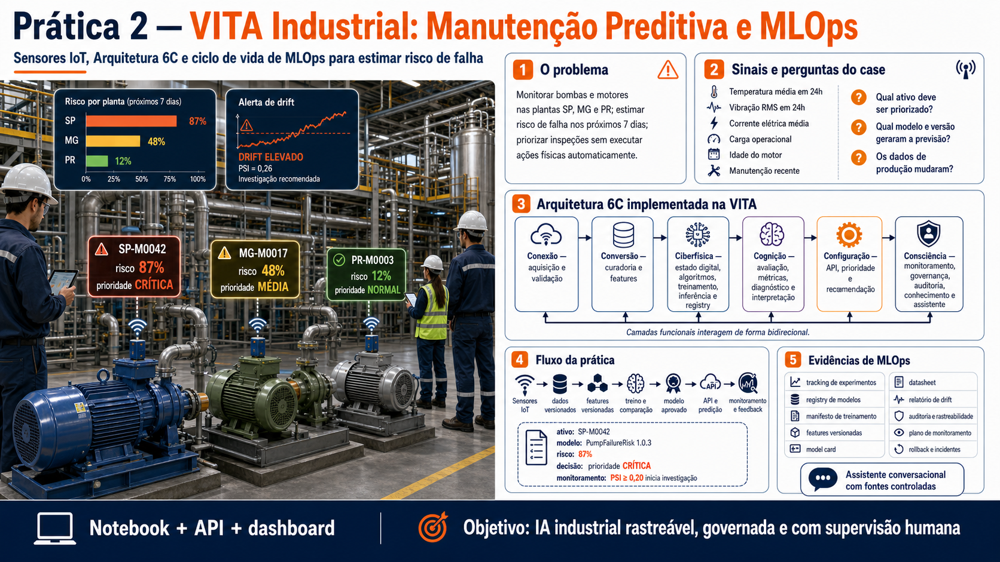

# VITA Industrial - Manutenção Preditiva e MLOps

Projeto educacional do curso **IA, Otimização e IoT para Indústrias e Negócios - Do Zero ao MLOps**.

## Visão geral da Prática 2



## Sequência das práticas

Na **Prática 1**, o estudante parte de um experimento de visão computacional em
notebook e transforma a inferência em um serviço de API. Na **Prática 2**, este
projeto amplia a discussão: um case industrial completo de manutenção preditiva é
estruturado pela Arquitetura 6C, implementado na plataforma VITA e acompanhado
durante todo o ciclo de vida de MLOps.

O case estima o risco de falha de bombas e motores nos próximos sete dias a partir de sensores IoT. A solução segue a Arquitetura 6C materializada na VITA e incorpora tracking, registry, versionamento, monitoramento, model card, datasheet, auditoria e uma interface conversacional baseada em fontes controladas.

## Case industrial

Uma empresa monitora bombas e motores instalados nas plantas de São Paulo, Minas Gerais e Paraná. Cada leitura contém:

- temperatura média em 24 horas;
- vibração RMS em 24 horas;
- corrente elétrica média;
- carga operacional;
- idade do motor;
- manutenção recente.

O sistema deve estimar risco, priorizar inspeções e acompanhar mudanças nos dados sem executar automaticamente ações físicas críticas.

## Arquitetura 6C implementada na VITA

| Camada | Implementação no projeto |
| --- | --- |
| Conexão | aquisição simulada, identificação, schema e validação de sensores |
| Conversão | curadoria, transformação e features versionadas |
| Ciberfísica | estado digital, algoritmos, treinamento, inferência e registry |
| Cognição | avaliação, métricas, diagnóstico e interpretação |
| Configuração | API, classificação de risco e recomendação operacional |
| Consciência | drift, governança, conhecimento, auditoria e assistente |

```text
sensores IoT
    -> Conexão
    -> Conversão
    -> Ciberfísica
    -> Cognição
    -> Configuração
    -> Consciência
```

As camadas são níveis funcionais que interagem de forma bidirecional, não uma sequência rígida. Tracking, versionamento e documentação conectam evidências produzidas em todo o ciclo de vida.

### Organização pedagógica

A VITA de referência pode separar algoritmos e serviços no nível superior. Nesta prática, o código é deliberadamente organizado pela camada responsável para que os estudantes enxerguem a correspondência entre arquitetura e implementação. Cada pasta de camada possui um `README.md` com responsabilidade, entradas, saídas, evidências e retroalimentação.

## Estrutura

```text
vita/
├── backend/
│   ├── app.py
│   ├── config.py
│   ├── layers/
│   │   ├── connection/
│   │   ├── conversion/
│   │   ├── cyber_physical/
│   │   │   └── algorithms/
│   │   ├── cognition/
│   │   ├── configuration/api/
│   │   └── consciousness/
│   │       ├── assistant/
│   │       ├── governance/
│   │       ├── knowledge/
│   │       └── monitoring/
│   └── docs/
├── frontend/streamlit/
├── notebooks/
├── data/
├── artifacts/
├── docs/governance/
├── tests/
├── Dockerfile.api
├── Dockerfile.dashboard
└── docker-compose.yml
```

## Principais artefatos MLOps

| Artefato | Finalidade |
| --- | --- |
| `artifacts/tracking/mlflow.db` | tracking local no MLflow |
| `artifacts/tracking/runs.csv` | histórico legível dos experimentos |
| `artifacts/registry.json` | versões e estágio dos modelos |
| `artifacts/manifests/training_manifest.json` | dados, código, features, seed e ambiente |
| `artifacts/manifests/feature_definitions.json` | definição versionada das features |
| `artifacts/reports/drift_report.json` | comparação treino versus produção |
| `docs/governance/model_card.md` | uso, métricas, riscos e limitações |
| `docs/governance/datasheet.md` | origem, composição e limites dos dados |
| `docs/governance/traceability_report.md` | ligação entre todas as evidências |
| `docs/governance/versioning_plan.md` | plano de código, dados, features, ambiente e modelo |
| `docs/governance/experiment_protocol.md` | execução, comparação, aprovação e registro |
| `docs/governance/monitoring_plan.md` | indicadores, limites e respostas |
| `docs/governance/responsibility_matrix.md` | papéis de desenvolvimento e operação |
| `docs/governance/incident_and_rollback.md` | retirada, restauração e aprendizado com incidentes |
| `artifacts/tracking/audit.jsonl` | trilha de decisões e responsabilidades |

Os arquivos são gerados durante o treinamento e o monitoramento.

## Obtenção do código

Substitua os placeholders quando o repositório educacional for publicado:

```bash
git clone <URL_DO_REPOSITORIO>
cd <PASTA_DO_REPOSITORIO>
```

## Ambiente local

Recomenda-se Python 3.11 ou 3.12.

```bash
python3 -m venv .venv
source .venv/bin/activate
python -m pip install --upgrade pip
python -m pip install -r requirements.txt
```

No Windows PowerShell:

```powershell
py -m venv .venv
.venv\Scripts\Activate.ps1
python -m pip install --upgrade pip
python -m pip install -r requirements.txt
```

### Commit e rastreabilidade

O manifesto tenta registrar o commit atual. Antes da demonstração de versionamento, faça o primeiro commit do repositório:

```bash
git add .
git commit -m "estrutura inicial do case VITA industrial"
```

Sem um commit, o campo `code_commit` será registrado como `uncommitted`. Isso é intencional: uma execução não versionada não deve fingir que possui rastreabilidade completa.

## Notebook da prática

Inicie o JupyterLab:

```bash
jupyter lab
```

Abra:

```text
notebooks/02_vita_manutencao_preditiva_6c.ipynb
```

O notebook percorre as seis camadas e termina reconstruindo a linhagem da versão em produção.

## API

Inicie o backend na raiz do projeto:

```bash
uvicorn backend.app:app --reload
```

Acesse:

- Swagger: <http://localhost:8000/docs>
- Saúde: <http://localhost:8000/health>
- Arquitetura: <http://localhost:8000/api/v1/architecture>

### Sequência recomendada no Swagger

1. `POST /api/v1/train`
2. `GET /api/v1/experiments`
3. `GET /api/v1/registry`
4. `POST /api/v1/predict`
5. `POST /api/v1/monitor`
6. `GET /api/v1/governance/model-card`
7. `GET /api/v1/governance/datasheet`
8. `GET /api/v1/governance/traceability`
9. `POST /api/v1/consciousness/assistant`

### Treinamento

```json
{
  "n_samples": 1200,
  "seed": 42
}
```

São comparados Regressão Logística, Random Forest e Gradient Boosting. A seleção considera custo esperado e recall de falhas. O modelo aprovado recebe uma versão no registry; a versão de produção anterior é arquivada.

### Inferência

```json
{
  "machine_id": 42,
  "plant": "SP",
  "motor_age_days": 1200,
  "temp_mean_24h": 88.5,
  "vibration_rms_24h": 5.2,
  "current_mean_24h": 19.5,
  "load_mean_24h": 0.97,
  "maintenance_last_30d": 0
}
```

A resposta separa:

- `asset`: estado digital da máquina;
- `prediction`: risco e versão do modelo;
- `decision`: prioridade e recomendação.

### Monitoramento

```json
{
  "n_samples": 1000,
  "seed": 99,
  "drift": true
}
```

O monitor calcula PSI por feature. Valores a partir de `0.20` geram investigação, não retreinamento automático.

## Tracking com MLflow

Após o primeiro treinamento:

```bash
mlflow ui \
  --backend-store-uri sqlite:///artifacts/tracking/mlflow.db \
  --port 5000
```

Acesse <http://localhost:5000>.

O projeto também mantém `runs.csv`, permitindo explicar tracking antes de abrir a interface do MLflow.

## Dashboard

Com a API em execução, abra outro terminal:

```bash
source .venv/bin/activate
streamlit run frontend/streamlit/app.py
```

Acesse <http://localhost:8501>.

O dashboard permite:

- visualizar as seis camadas;
- treinar e comparar candidatos;
- consultar o registry;
- calcular risco de uma máquina;
- simular drift;
- ler model card e datasheet.
- reconstruir a rastreabilidade e consultar a auditoria;
- conversar com a camada de Consciência sobre versões, dados, monitoramento e governança.

### O que precisa ser executado primeiro?

A página **Visão geral 6C** precisa apenas que a API esteja ativa. Para as demais
funcionalidades, a sequência recomendada é:

1. abrir **Treinamento e tracking** e executar o primeiro treinamento;
2. consultar as runs e a versão promovida no registry;
3. realizar uma inferência;
4. executar o monitoramento de drift;
5. consultar model card, datasheet, rastreabilidade e auditoria;
6. conversar com o assistente da camada de Consciência.

O treinamento cria os dados versionados, modelos candidatos, métricas, manifesto,
registry e documentos que alimentam as outras páginas. Ele não é necessário para
que os cartões das seis camadas apareçam.

## Assistente da camada de Consciência

O assistente não é a fonte da verdade. Ele recebe um snapshot controlado do registry, tracking, manifestos, feature definitions, drift, documentos e auditoria. Sem chave da OpenAI, a prática usa respostas locais determinísticas.

Para demonstrar a integração com a API da OpenAI:

```bash
cp .env.example .env
# edite .env e preencha OPENAI_API_KEY
```

A aplicação usa a [Responses API](https://platform.openai.com/docs/api-reference/responses). A chave permanece no backend, não deve aparecer no dashboard e não deve ser versionada. O modelo pode ser alterado por `VITA_OPENAI_MODEL`.

## Documentação Sphinx

```bash
sphinx-build -b html backend/docs/source backend/docs/build/html
```

Com a API reiniciada, abra <http://localhost:8000/html/docs/>.

## Testes

```bash
pytest -q
```

Os testes usam uma pasta temporária e não alteram o registry utilizado na demonstração.

## Docker Compose

O Docker é opcional. Ele inicia API e dashboard como serviços separados:

```bash
docker compose up --build
```

Acesse:

- API: <http://localhost:8000/docs>
- Dashboard: <http://localhost:8501>

Os diretórios `artifacts`, `data` e `docs/governance` são montados como volumes para preservar as evidências geradas.

Para encerrar:

```bash
docker compose down
```

## Limites e responsabilidade

Este é um case educacional com dados sintéticos. Ele não deve ser utilizado para controlar equipamentos reais. Antes de qualquer uso industrial seriam necessários dados representativos, integração segura, validação com especialistas, gestão de acesso, observabilidade, testes de carga, análise de risco e aprovação formal.

## Base científica

A arquitetura utilizada deriva do trabalho:

> Guidotti, F. P., da Silva Arantes, J., da Silva Arantes, M., Bedoya, A. E., & Toledo, C. F. M. (2024). Six-Layer Industrial Architecture Applied to Predictive Maintenance. Proceedings of ICSOFT, 123-130.

## Autoria

**Fernanda Pereira Guidotti Carneiro**  
Universidade de São Paulo - ICMC/USP
