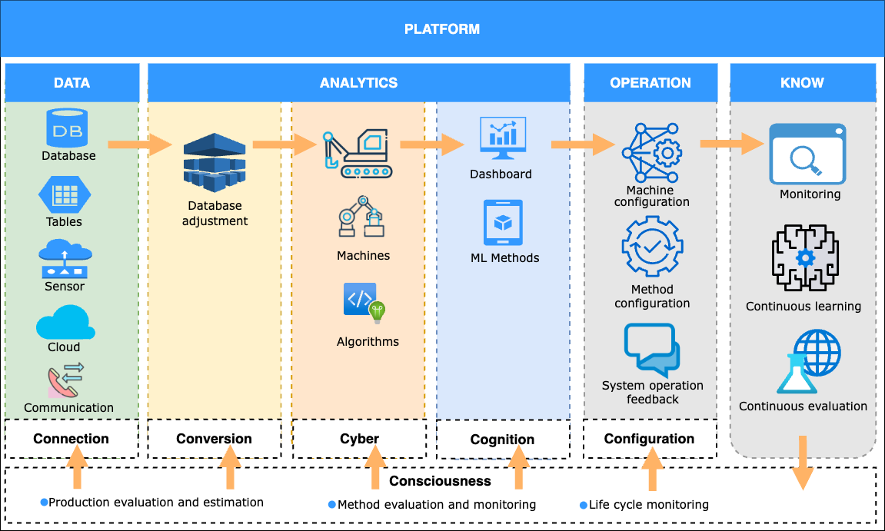

Arquitetura 6C implementada na VITA
===================================

Connection
----------

Aquisição simulada de sensores IoT, contrato de dados, validação de schema e faixas plausíveis.

Código: ``backend/layers/connection/``.

Conversion
----------

Transformação das leituras e geração de features compartilhadas entre treino e inferência.

Código: ``backend/layers/conversion/``.

Ciberfísica
--------------

Representação digital da máquina, algoritmos, treinamento, inferência e registro dos modelos. Na correspondência com o CRISP-DM, a modelagem pertence a esta camada.

Código: ``backend/layers/cyber_physical/``.

Cognição
---------

Avaliação, métricas, diagnóstico e interpretação dos modelos e previsões.

Código: ``backend/layers/cognition/``.

Configuração
-------------

API, combinação do risco com o estado do ativo, prioridade e recomendação operacional.

Código: ``backend/layers/configuration/``.

Consciência
-------------

Monitoramento, governança, conhecimento, documentação, auditoria, feedback e interface conversacional. Consolida evidências e apoia decisões; não executa automaticamente retreinamento ou intervenção física.

Código: ``backend/layers/consciousness/``.

Organização pedagógica
----------------------

Esta implementação coloca os componentes dentro da camada responsável para tornar a arquitetura observável aos estudantes. Cada diretório contém um ``README.md`` com responsabilidade, entradas, saídas, evidências de MLOps e retroalimentação.
